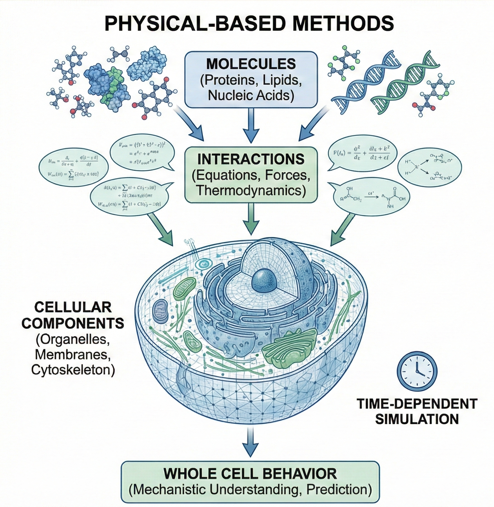
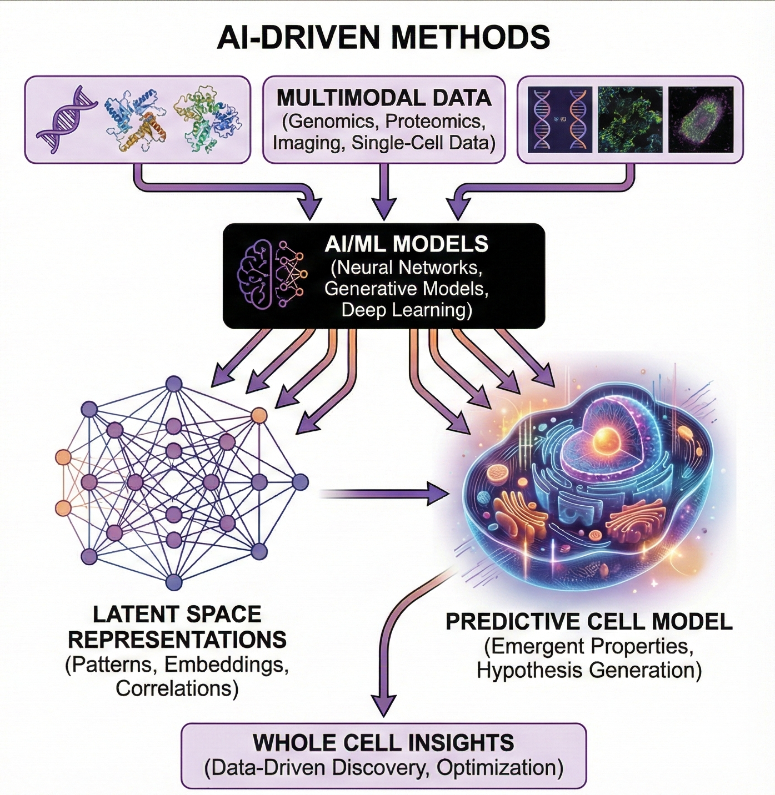

# Awesome Virtual Cell & Whole-Cell Modeling Papers

A curated collection of important papers, methods, and GitHub repositories for virtual cell and whole-cell modeling.

## Table of Contents

- [Physics-Based Modeling](#physics-based-modeling)
- [AI/Data-Driven Modeling](#aidata-driven-modeling)
- [Software Ecosystem](#software-ecosystem)
- [Others](#other-papers)

---

## Physics-Based Modeling

### Zan Luthey-Schulten Lab (University of Illinois at Urbana-Champaign)

*   **[Whole Cell Modeling: From Single Cells to Colonies](https://doi.org/10.1002/ijch.201300147)**
    *   Cole JA, Luthey-Schulten Z. (2014) *Isr. J. Chem.*
    *   *Note: A foundational review.*

*   **Bringing the Genetically Minimal Cell to Life on a Computer in 4D**
    *   Thornburg et al. (2025) *bioRxiv*.
    *   **Method:** Hybrid 4D spatiotemporal modeling combining Lattice Microbes (stochastic reaction-diffusion), LAMMPS (Brownian dynamics for chromosome), and ODEs (metabolism).
    *   **Code:** [4DWCM](https://github.com/Luthey-Schulten-Lab/Minimal_Cell_4DWCM)

*   **[Fundamental behaviors emerge from simulations of a living minimal cell](https://doi.org/10.1016/j.cell.2021.12.025)**
    *   Thornburg et al. (2022) *Cell*.
    *   **Code:** [MinCell](https://github.com/Luthey-Schulten-Lab/Minimal_Cell)

### Markus Covert Lab (Stanford University)

*   **[A whole-cell computational model predicts phenotype from genotype](https://doi.org/10.1016/j.cell.2012.05.022)**
    *   Karr JR, Sanghvi JC, Macklin DN, et al. (2012) *Cell*.
    *   **Code:** [WholeCell](https://github.com/CovertLab/WholeCell)

*   **[Simultaneous cross-evaluation of heterogeneous E. coli datasets via mechanistic simulation](https://doi.org/10.1126/science.aav3751)**
    *   Macklin DN et al. (2020) *Science*.
    *   **Code:** [WCM_ecoli](https://github.com/CovertLab/WholeCellEcoliRelease)

*   **[The E. coli Whole-Cell Modeling Project](https://doi.org/10.1128/ecosalplus.ESP-0001-2020)**
    *   Sun G, Ahn-Horst TA, Covert MW. (2021) *EcoSal Plus*.

*   **[An expanded whole-cell model of E. coli links cellular physiology with mechanisms of growth rate control](https://doi.org/10.1038/s41540-022-00242-9)**
    *   Ahn-Horst TA, Mille LS, Sun G, et al. (2022) *npj Syst Biol Appl*.

### Roseanna Zia Lab (University of Missouri)
*Focus: Colloidal-scale physics, hydrodynamics, and crowding.*

*   **[The matter/life nexus in biological cells](https://arxiv.org/abs/2412.01743)**
    *   Sivasankar VS, Zia RN. (2024) *arXiv:2412.01743* [physics.bio-ph].
    *   *Note: Comprehensive review on physics-based modeling and the matter-life interface.*

### Structural & Molecular Dynamics Models

*   **[Molecular dynamics simulation of an entire cell](https://doi.org/10.3389/fchem.2023.1106495)** (Martini Model)
    *   Stevens JA et al. (2023) *Front. Chem.*
    *   *Group:* Martini Group (University of Groningen).

*   **[Building structural models of a whole mycoplasma cell](https://doi.org/10.1016/j.jmb.2021.167351)**
    *   Maritan M, Autin L, Karr J, Covert MW, Olson AJ, Goodsell DS. (2022) *J. Mol. Biol.*
    *   *Group:* Olson/Goodsell Lab (Scripps Research).

### Constraint-Based & Metabolic Models (FBA)

#### 1. Yeast-GEM
*   **[Yeast9: a consensus genome-scale metabolic model for S. cerevisiae curated by the community](https://doi.org/10.1038/s44320-024-00060-7)**
    *   Zhang C et al. (2024) *Mol. Syst. Biol.*
    *   **Code:** [Yeast-GEM](https://github.com/SysBioChalmers/yeast-GEM)

#### 2. ETFL (Expression and Thermodynamics Flux)
*Includes thermodynamics constraints and macromolecular expression.*

*   **[The ETFL formulation allows multi-omics integration in thermodynamics-compliant metabolism and expression models](https://doi.org/10.1038/s41467-019-13818-7)**
    *   Salvy P, Hatzimanikatis V. (2020) *Nat. Commun.*

*   **[A genome-scale metabolic model of Saccharomyces cerevisiae that integrates expression constraints and reaction thermodynamics](https://doi.org/10.1038/s41467-021-25158-6)**
    *   Oftadeh O, Salvy P, Masid M, et al. (2021) *Nat. Commun.*

*   **[Genome-scale models of metabolism and expression predict the metabolic burden of recombinant protein expression](https://doi.org/10.1016/j.ymben.2024.06.005)**
    *   Oftadeh O, Hatzimanikatis V. (2024) *Metab. Eng.*

*   **Code:**
    *   [ETFL (Generic)](https://github.com/EPFL-LCSB/etfl.git)
    *   [ecoli-ETFL](https://github.com/EPFL-LCSB/ecetfl/)
    *   [yeast-ETFL](https://github.com/EPFL-LCSB/yetfl)

---

## AI/Data-Driven Modeling

### AI Virtual Cell (CZI Biohub / Arc Institute)

*   **Initiative:** [How to build the virtual cell with artificial intelligence: Priorities and opportunities](https://doi.org/10.1016/j.cell.2024.09.006)
    *   Bunne C et al. (2024) *Cell*.

*   **Challenge:** [Virtual Cell Challenge: Toward a Turing test for the virtual cell](https://doi.org/10.1016/j.cell.2025.01.001)
    *   Roohani YH et al. (2025) *Cell*.

#### STATE: Model by Arc Institute (June 2025)

*   **[Predicting cellular responses to perturbation across diverse contexts with State](https://doi.org/10.1101/2025.06.26.661135)**
    *   Adduri AK et al. (2025) *bioRxiv*.
    *   **News:** [Arc Institute’s first virtual cell model: State](https://arcinstitute.org/news/virtual-cell-model-state)
    *   **Method:** Centralized open-source hub with NVIDIA GPU infrastructure hosting models (CodonFM, MONAI), datasets, and benchmarks.
    *   **Code:** [STATE](https://github.com/ArcInstitute/state)

---

## Software Ecosystem

### 1. Integrated & Multiscale Modeling Platforms
*These platforms are designed to bridge different scales (molecular to cellular) or integrate various modeling approaches (deterministic, stochastic, spatial) into a unified environment.*

| Platform | Key Developer / PI | Methodology & Key Features | Links |
| :--- | :--- | :--- | :--- |
| **Virtual Cell (VCell)** | **Leslie Loew** (UConn Health) | **Unified Environment:** Integrates reaction-diffusion, spatial modeling, rule-based modeling (BioNetGen), and particle-based simulation (SpringSaLaD) in one interface. | [Website](https://vcell.org/) |
| **Vivarium** | **Eran Agmon** (UConn) | **Integrative Framework:** Python-based engine using "Process Bigraphs" to composite diverse models across scales and languages into a single simulation. | [GitHub](https://github.com/vivarium-collective/vivarium-core) |
| **Morpheus** | **Jörn Starruß** (TU Dresden) | **Hybrid Cell-Based:** User-friendly GUI for multiscale modeling. Combines Cellular Potts Models (CPM) for mechanics with ODE/PDE systems for biochemistry. | [Website](https://morpheus.gitlab.io) |

### 2. Multicellular & Tissue Simulation (Agent-Based)
*These tools focus on the behavior of cell populations, tissue mechanics, and the microenvironment, often using Agent-Based Modeling (ABM) or the Cellular Potts Model (CPM/GGH).*

| Platform | Key Developer / PI | Methodology & Key Features | Links |
| :--- | :--- | :--- | :--- |
| **PhysiCell** | **Paul Macklin** (Indiana Univ) | **Tissue-Scale ABM:** Optimized for 3D multicellular systems, focusing on cell mechanics, diffusion fields, and tumor microenvironments. | [Website](http://physicell.org) |
| **CompuCell3D** | **Maciej Swat** | **Cellular Potts Model:** Couples cell mechanics and shape changes with reaction-diffusion processes. Supports Python scripting for complex tissue logic. | [Website](https://compucell3d.org) |
| **Chaste** | **Gary Mirams** (Nottingham) | **High-Performance C++:** A modular library specialized for cardiac electrophysiology, soft tissue mechanics, and cancer modeling. | [Website](https://chaste.github.io) |

### 3. Intracellular Network & Pathway Simulators
*These tools specialize in modeling the biochemical logic, signaling pathways, and reaction kinetics within a cell, using ODEs or rule-based definitions.*

| Platform | Key Developer / PI | Methodology & Key Features | Links |
| :--- | :--- | :--- | :--- |
| **COPASI** | **Stefan Hoops** (Virginia Tech) | **Biochemical Kinetics:** Simulates networks using ODEs/SDEs. Robust tools for parameter estimation, sensitivity analysis, and time-course analysis. | [Website](http://copasi.org) |
| **BioNetGen** | **James Faeder** (Pitt) | **Rule-Based Modeling:** Uses BNGL to model signal transduction, handling the combinatorial complexity of protein-protein interactions. | [Website](https://bionetgen.org) |
| **PySB** | **Carlos Lopez** (Altos Labs) | **Python Framework:** A programming environment for biological models. Interoperable with BioNetGen and Kappa for composable modeling. | [Website](https://pysb.org) |
| **CellNOpt** | **C. Terfve** | **Logic Modeling:** Trains protein signaling networks to data using logic, fuzzy logic, or differential logic formalisms. | [Website](https://saezlab.github.io/CellNOptR) |

### 4. Stochastic & Particle-Based Simulators
*These tools model biology at the highest resolution, tracking individual molecules or particles to capture spatial stochasticity and diffusion in 3D.*

| Platform | Key Developer / PI | Methodology & Key Features | Links |
| :--- | :--- | :--- | :--- |
| **Lattice Microbes** | **Zan Luthey-Schulten** (UIUC) | **Stochastic Reaction-Diffusion:** Simulates biochemical networks in realistic 3D cellular geometries using lattice-based methods on GPUs. | [GitHub](https://github.com/Luthey-Schulten-Lab/Lattice_Microbes) |
| **Smoldyn** | **Steve Andrews** (Fred Hutch) | **Particle-Based:** Simulates molecular diffusion, surface interactions, and excluded volume with high spatial precision. | [Website](http://www.smoldyn.org) |
| **MCell** | **T. Bartol / T. Sejnowski** (Salk) | **Monte Carlo:** 3D reaction-diffusion simulator. Highly integrated with Blender for complex geometry construction. | [Website](https://mcell.org) |
| **ReaDDy** | **Frank Noé** (FU Berlin) | **Interacting Particles:** Software for particle-based reaction dynamics that accounts for crowding and molecular potentials. | [Website](https://readdy.github.io) |

### 5. AI: Generative Models & Omics Analysis
*These AI models use Deep Learning (VAEs, Transformers, GNNs) to integrate multi-omics data, denoise datasets, and infer cell states.*

| Model | Key Reference | Methodology & Key Features | Links |
| :--- | :--- | :--- | :--- |
| **scVI / totalVI** | **Gayoso et al.** | **Deep Generative (VAE):** Handles batch integration and joint probabilistic modeling of RNA and protein single-cell data. | [GitHub](https://github.com/scverse/scvi-tools) |
| **GeneFormer** | **Theodoris et al.** | **Foundation Model:** Large-scale transformer pretrained on gene expression. Enables transfer learning for cell-type and gene-function inference. | [GitHub](https://github.com/jkobject/geneformer) |
| **GLUE** | **Cao et al.** | **Multi-Omics Graph:** Uses regulatory network priors to project heterogeneous single-cell omics into a shared embedding space. | [GitHub](https://github.com/gao-lab/GLUE) |
| **GraphST** | **Long et al.** | **Spatial GNN:** Graph neural network that couples expression data with spatial proximity for cell-type identification. | [GitHub](https://github.com/JinmiaoChenLab/GraphST) |

### 6. AI: Perturbation & Drug Response Prediction
*These models specifically target the "Virtual Cell" goal of predicting how a cell reacts to drugs or genetic edits.*

| Model | Key Reference | Methodology & Key Features | Links |
| :--- | :--- | :--- | :--- |
| **GEARS** | **Roohani et al.** | **Knowledge Graph AI:** Predicts transcriptional outcomes of novel multi-gene perturbations using knowledge graphs. | [GitHub](https://github.com/snap-stanford/GEARS) |
| **DrugCell** | **Kuenzi / Ideker** |  **Interpretable AI:** Predicts drug response by unifying transcriptomes with drug molecular graphs and biological target networks. | [GitHub](https://github.com/idekerlab/DrugCell) |

> **References:** Ma C, Zhang H, Rao Y, et al. (2025) "AI-driven virtual cell models in preclinical research: technical pathways, validation mechanisms, and clinical translation potential." *npj Digit. Med.* [DOI](https://doi.org/10.1038/s41746-025-02198-6)

---

## Other papers

---

## Contributing

Contributions welcome! Please add papers, methods, and repositories following the existing format.

## License

MIT license. See [LICENSE](LICENSE) file for details.
